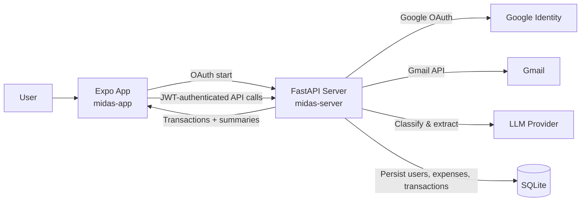
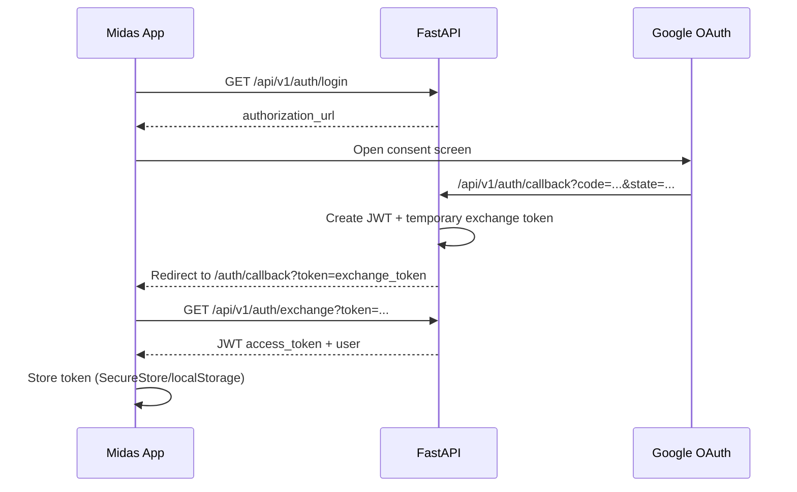
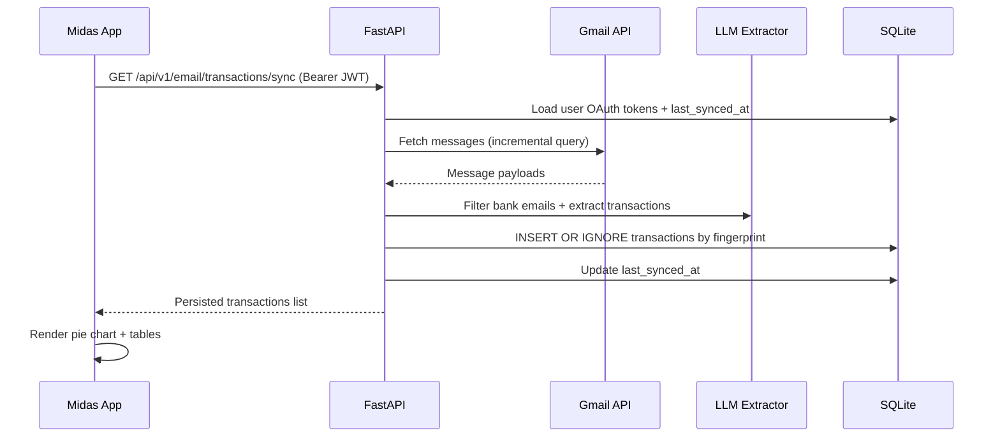

# Midas


Midas is an AI-powered expense intelligence project built as a full-stack system:

- A mobile/web app (`midas-app`) built with Expo + React Native + Expo Router.
- A backend API (`midas-server`) built with FastAPI + SQLite.
- Gmail + Google OAuth integration to securely fetch bank emails.
- LLM-powered extraction and categorization of transaction data.

The app helps users automatically turn transactional emails into structured spend insights.

<p align="center">
	
	
</p>

## Project Structure

```text
midas/
├─ midas-app/      # Expo React Native client (iOS / Android / Web)
├─ midas-server/   # FastAPI backend + OAuth + Gmail + LLM pipeline
└─ README.md
```

## What The Project Does

1. User signs in with Google OAuth.
2. Backend stores user + OAuth tokens in SQLite.
3. App triggers transaction sync from Gmail via backend.
4. Backend fetches emails incrementally and classifies bank-related ones using an LLM.
5. Extracted transactions are normalized and persisted with dedupe fingerprinting.
6. App displays category-wise insights and detailed transaction views.

## Architecture



## Frontend Architecture (`midas-app`)

- Routing: Expo Router (`app/`, tabs + auth routes).
- State: Zustand (`store/auth.store.ts`) for user/session/transactions.
- Data calls: Axios services (`services/*.ts`) + React Query hooks.
- Views:
	- Home dashboard with category pie chart and spend table.
	- Expenses tab with detailed transaction list.
	- Settings tab for account/session controls.

## Backend Architecture (`midas-server`)

- API framework: FastAPI (`main.py`) with versioned routes under `/api/v1`.
- Auth:
	- Google OAuth initiation/callback/exchange under `/api/v1/auth/*`.
	- JWT issuance and validation for protected routes.
- Email + transaction pipeline:
	- Gmail message fetch with incremental `after:` queries.
	- LLM bank-email filtering and transaction extraction.
	- Idempotent inserts into `transactions` using `txn_fingerprint`.
- Persistence: SQLite schema in `db/schema.sql`.

## End-to-End Flow

### 1) Authentication Flow



### 2) Transaction Sync Flow



## API Surface (High-Level)

- `GET /api/v1/auth/login` - starts OAuth login.
- `GET /api/v1/auth/callback` - OAuth callback handler.
- `GET /api/v1/auth/exchange` - temporary token to JWT exchange.
- `GET /api/v1/email/transactions/sync` - sync Gmail-derived transactions.
- `GET /api/v1/expenses` - list expenses.
- `POST /api/v1/expenses` - create expense.

## Project Snapshots

These are current visual assets from the repository.

### Brand Lockup


## Tech Stack

- Frontend: Expo, React Native, Expo Router, TypeScript, Zustand, React Query, Axios.
- Backend: FastAPI, Pydantic, Authlib, SQLAlchemy tooling, SQLite.
- Integrations: Google OAuth, Gmail API, LLM provider (OpenAI/Groq/Ollama via config).

## Run Locally (Quick Start)

### 1) Start Backend

```bash
cd midas-server
uv sync
uv run python db/init_sqlite.py
uv run python main.py
```

Backend default: `http://localhost:8000`

### 2) Start App

```bash
cd midas-app
npm install
npm run start
```

App dev server default: `http://localhost:8081`

## Notes

- `midas-app/constants/config.ts` defines client-side backend URLs.
- `midas-server/app/config.py` controls OAuth, LLM, and security settings.
- For production, replace in-memory auth/token exchange stores with Redis or persistent storage.

